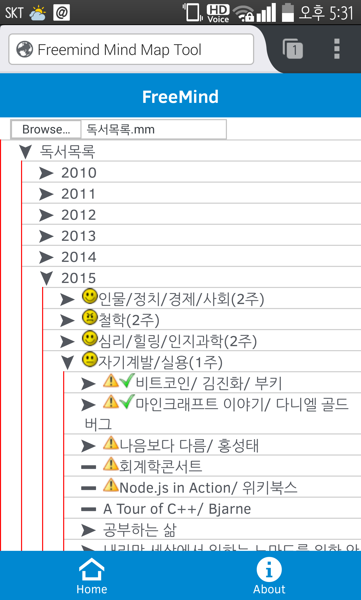

freemind-webapp
===============

html5 version of FreeMind (Mind-Mapping Tool)    
http://freemind.sourceforge.net/wiki/index.php/Main_Page

the goals of this project are
- Supporting read/write compatibility with Freemind *.mm file
- Supporting Android and iOS with Browser or Phone-gap

designed by ingee@paran.com    
since 2014.6.

---
dev env setup
```bash
cd src
npm install
bower install
bower install intel-appframework#2.1.1
```

---
dev command (@src directory)
- test in browser : ` grunt serve `
- build : ` grunt build `

---
you can test this FreeMind webapp at following URL    
https://stark-citadel-1898.herokuapp.com/index.html   
- tested only on Android FireFox browser (need help)
- Scroll is not working on PC (known issue, also need help)

freemind-webapp-screen-shot.png   


(end)
